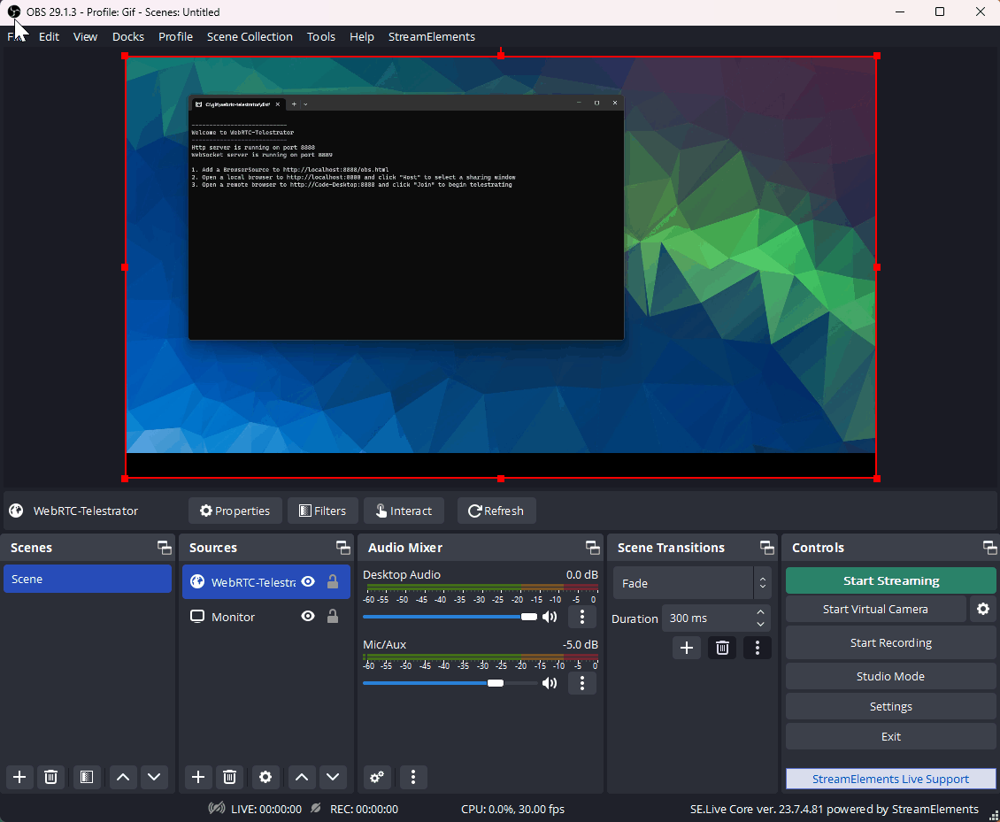

# WebRTC-Telestrator

[](https://opensource.org/licenses/MIT)
[](https://nodejs.org/)

Real-time collaborative drawing tool for content creators. Features Apple Pencil optimization, WebRTC synchronization, OBS integration, and responsive touch controls for seamless telestration during live streams and recordings.

Use a remote device (iPad, phone, or tablet) to draw on your screen while recording/streaming via OBS. Rather than just having a blank 'greenscreen' to draw on, this app streams your actual display so you can see exactly where you're drawing in real-time.

> **Note**: This project is a revamped and re-written version of the original [WebRTC-Telestrator by BlankSourceCode](https://github.com/BlankSourceCode/WebRTC-Telestrator). It includes major performance improvements, Apple Pencil support, and enhanced UI controls.

## 🎥 Demo



*Real-time drawing with Apple Pencil support and OBS integration*

## ✨ Features

- 🖊️ **Apple Pencil Support** - Optimized for iPad with hover preview and sub-10ms latency
- 🎬 **OBS Integration** - Transparent overlay for streaming/recording with MJPEG output
- 🌐 **WebRTC Connection** - Low-latency real-time synchronization between devices
- 📱 **Cross-Platform** - Works on iPad, desktop, and mobile browsers
- 🎨 **Drawing Tools** - Multiple colors, adjustable brush sizes, undo/clear functions
- ⚡ **Performance Optimized** - 120Hz support, reduced input lag, and smooth drawing
- 🔄 **Reliable Connections** - Fixed reconnection issues and improved stability
- 🎯 **Precision Controls** - Adjustable canvas positioning and responsive toolbar

## Prerequisites

- Node.js (v12 or higher)
- OBS Studio (for streaming/recording)
- A WebRTC-compatible browser (Chrome, Edge, Firefox, Safari)

## 🚀 Quick Start

```bash
git clone https://github.com/BrennanB/WebRTC-Telestrator.git
cd WebRTC-Telestrator
npm install
npm start
```

Open http://localhost:8888 and start drawing!

## 📦 Installation

1. **Clone this repository:**
   ```bash
   git clone https://github.com/BrennanB/WebRTC-Telestrator.git
   cd WebRTC-Telestrator
   ```

2. **Install dependencies:**
   ```bash
   npm install
   ```

3. **Start the application:**
   ```bash
   npm start
   ```
   
   Or with a custom port:
   ```bash
   npm start -- -p 9999
   ```

The server will start on port 8888 (HTTP) and 8889 (WebSocket) by default.

## Usage

### 1. Start the Server
Launch the application using `npm start`. This will:
- Start an HTTP server on port 8888 (default)
- Start a WebSocket server on port 8889 (HTTP port + 1)
- Display connection URLs in the console

### 2. Configure OBS Studio
1. In OBS, add a new **Browser Source**
2. Set the URL to: `http://localhost:8888/obs.html`
3. Set the width and height to match your canvas resolution (e.g., 1920x1080)
4. Check "Shutdown source when not visible" and "Refresh browser when scene becomes active"
5. Position this browser source as an overlay on your scene

### 3. Host a Session (on the streaming computer)
1. Open a modern browser (Chrome, Edge, Firefox) on your streaming machine
2. Navigate to `http://localhost:8888`
   - **Important**: Use `localhost`, not your machine name or IP, to avoid WebRTC security restrictions
3. Click the **"Host Session"** button
4. Select the window or screen you want to share:
   - Option 1: Select your entire monitor
   - Option 2: In OBS, right-click a source → "Windowed Projector (Source)" → Select that window

### 4. Join from a Remote Device
1. On your drawing device (tablet, phone, another computer), open a browser
2. Navigate to `http://[host-computer-ip]:8888`
   - Find your host computer's IP address using `ipconfig` (Windows) or `ifconfig` (Mac/Linux)
   - Example: `http://192.168.1.100:8888`
3. Click the **"Join"** button
4. You should now see the host's shared screen as your canvas background

### 5. Drawing Controls
Once connected, you'll see drawing tools at the top of the screen:
- **Offset**: Vertical spacing from the top (default: 12)
- **Inset**: Horizontal padding on sides (default: 1)
- **Clear** (⊗): Clear all drawings
- **Undo** (⟲): Undo last stroke
- **Color options**: White, black, red, green, blue, yellow, or custom color picker
- **Line width**: Adjustable slider for stroke thickness
- **Toggle tools** (⇊): Show/hide the toolbar
- **Fullscreen** (⇉): Enter/exit fullscreen mode

## Example


## Troubleshooting

### Common Issues

1. **"Join" button only works once**
   - This has been fixed in this version. The host now properly resets its connection when a new client joins.

2. **Can't connect from remote device**
   - Ensure your firewall allows connections on ports 8888 and 8889
   - Verify both devices are on the same network
   - Use the host computer's actual IP address, not `localhost`

3. **No video showing on remote device**
   - Make sure the host has clicked "Host Session" and selected a window/screen
   - Check that both devices support WebRTC
   - Try refreshing both browsers and reconnecting

4. **Drawing not showing in OBS**
   - Verify the Browser Source URL is correct: `http://localhost:8888/obs.html`
   - Check that the Browser Source is visible and properly positioned in your scene
   - Try refreshing the Browser Source in OBS

### Browser Compatibility
- **Host**: Chrome, Edge, Firefox (desktop only)
- **Client**: Chrome, Edge, Firefox, Safari (desktop and mobile)

## Development Setup

1. Clone this repository
2. Install dependencies: `npm install`
3. For development with auto-reload: `npm run dev` (if available)
4. For debugging in VS Code:
   - Open the project folder in VS Code
   - Press `F5` to start debugging
   - The debugger will attach to the Node.js process

## 🛠️ Tech Stack

- **Frontend**: Vanilla JavaScript, Canvas API, Pointer Events
- **Backend**: Node.js, Express, WebSocket (ws)
- **Real-time Communication**: WebRTC Data Channels
- **Streaming**: MJPEG for OBS integration
- **UI**: Modern CSS with backdrop-filter and flexbox
- **Performance**: Desynchronized canvas context, touch event optimization

## 🤝 Contributing

Feel free to submit issues and pull requests. This project aims to provide a simple, reliable telestrator solution for content creators.

### Development Workflow
1. Fork the repository
2. Create a feature branch: `git checkout -b feature/new-feature`
3. Make your changes and test thoroughly
4. Commit with clear messages: `git commit -m "Add new feature"`
5. Push and create a pull request

## License

This project is licensed under the MIT License - see the [LICENSE](LICENSE) file for details.

## 🙏 Acknowledgments

- **Original concept and implementation** by [BlankSourceCode](https://github.com/BlankSourceCode/WebRTC-Telestrator)
- **Major rewrite** with Apple Pencil support, performance optimizations, and enhanced UI
- **Community feedback** for feature requests and bug reports

---

Made with ❤️ for content creators and live streamers